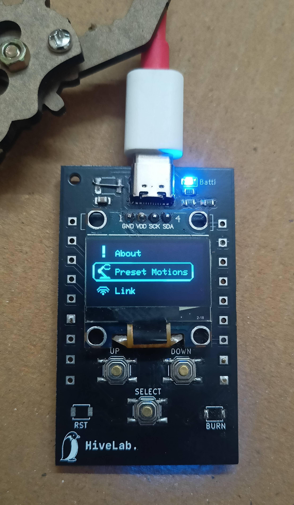

# 🤖 Robotic Hand with OLED Display & Web Interface – ESP8266 Based 4-Axis Arm

An advanced, yet affordable **ESP8266-based robotic arm project** featuring a **4-axis robotic hand** with dual control interfaces — a local **OLED-based console** and a remote **web interface**. Designed for factory simulations, educational use, and DIY robotics enthusiasts.

This project showcases how **ESP-12F, SG90/MG90 servos, and SSD1306 OLED** can be combined to build a fully functional, programmable **robotic hand system**.

---

## 🎯 Overview: ESP8266 Robotic Hand Project

This project is a complete demonstration of **low-cost automation** using the **ESP8266 microcontroller**, ideal for:

- STEM education and engineering projects  
- Small factories or prototype environments  
- Hobbyists building their first **IoT robotic arm**

The robotic hand features:

- Local **OLED UI with buttons** (like a mini robotic console)  
- Remote **Web Interface** for controlling axis motions  
- Modular firmware with **pre-programmed actions**  
- Smooth servo transitions, even without feedback sensors  

---

## 🔑 Key Features

- ✅ **4-Axis Robotic Arm with SG90/MG90 Servos**  
- 📟 **Interactive OLED Display Console** (ESP-12F + SSD1306 I2C)  
- 🌐 **Responsive Web Control Panel** (HTML/CSS/JS)  
- 🔁 **Pre-loaded Movements**: High Five, Rotate 180°, Dance, Demo, etc.  
- 🔀 **Dual Mode Control** – Use display or web seamlessly  
- 🔧 **Custom PCB Design in KiCad**  
- 🧠 **Optimized C++ Firmware** with `moveX(from, to)` style functions  
- ⚙️ **Easy Reprogramming for Custom Actions**  

---

## 🖥️ Hardware Overview: ESP12F Console

A compact, efficient board built around the **ESP8266 (ESP-12F)**:



- SSD1306 OLED (128×64 I2C)  
- 3 Buttons for UI navigation  
- GPIO headers for servo connections  
- Designed using **KiCad**  

---

## 📌 ESP8266 Robotic Arm Pinout

| Component               | GPIO Pin | NodeMCU Pin | Description                             |
|-------------------------|----------|-------------|-----------------------------------------|
| **OLED - SCL**          | GPIO 5   | D2          | Clock line for I2C OLED                 |
| **OLED - SDA**          | GPIO 4   | D1          | Data line for I2C OLED                  |
| **Button – Up**         | GPIO 14  | D5          | Navigate Up                             |
| **Button – Down**       | GPIO 12  | D6          | Navigate Down                           |
| **Button – A**          | GPIO 13  | D7          | Confirm/Enter                           |
| **Servo – Axis X**      | GPIO 0   | D3          | Forward-Backward motion                 |
| **Servo – Axis Y**      | GPIO 1   | D10         | Up-Down lift                            |
| **Servo – Axis Z**      | GPIO 2   | D4          | Claw or “Kekdha” motion                 |
| **Servo – Base (G)**    | GPIO 3   | D9          | Rotating the base of the arm            |

---

## 🌐 Web Interface for ESP8266 Robotic Arm

Control the robotic hand remotely using your browser:

🔗 **Live Demo:** [https://mohdamirwebdeveloper.github.io/robotic-hand](https://mohdamirwebdeveloper.github.io/robotic-hand)  
📷 **Scan the QR Code** printed on the board to access the control panel directly.

Features:

- Manual axis control sliders  
- Trigger buttons for pre-programmed actions  
- Mobile-responsive design  

---

## 🔧 Technologies & Tools

| Category               | Tool/Tech                    |
|------------------------|------------------------------|
| Microcontroller        | ESP-12F (ESP8266)            |
| Firmware               | Arduino C++                  |
| Display                | SSD1306 OLED (I2C)           |
| Web Interface          | HTML, CSS, JavaScript        |
| PCB Design             | KiCad                        |
| UI Graphics            | Adobe Photoshop              |

---

## 📦 Download & Flash Firmware

- **Firmware file:** `robotic-hand-v1.0.0.bin`  
- **Flash tools:** ESP8266 Flasher, `esptool.py`, OTA update  OR use Chrome `https://esp.huhn.me/`
- **Board:** Generic ESP8266 Module / NodeMCU ESP-12E  

```bash
# Example using esptool.py
esptool.py --port /dev/ttyUSB0 write_flash 0x00000 robotic-hand-v1.0.0.bin


